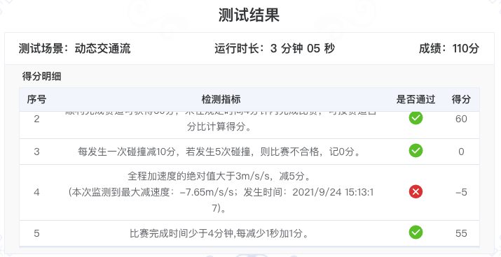

# ICVRCAutonomousDriving

#### 内容亮点
###### 感知
1. 纯视觉测距，使用旷视开源YOLOX模型进行目标检测，并基于该模型进行了前方障碍物单目测距
2. 使用点与三角形位置关系判断障碍所在车道位置 目标点取框底边中点
3. 识别三个车道最近障碍物的距离，为决策提供判据
4. 针对深度学习模型输出不稳定的特点，对单目测距的数据进行了平滑处理

###### 控制
1. 横纵控制分离的分段PID控制方式
2. 使用车身前2米处车道线的位置，提高了控制的前瞻性
3. 车规级车辆控制方式：follow, overtake, speedup，后期speedup和overtake无缝切换，成为马路杀手

#### 介绍
Python Implementation of Autunomous Driving Simulation

#### 软件架构
包含感知、决策、规划、控制相关部分

#### 安装教程
git clone git@gitee.com:icvrc2021-neu/icvrcautonomous-driving.git 到本地，可进行开发.

# 操作查询

## 分支操作
`务必养成良好习惯`

#### 创建分支
`创建新分支并切换`
git checkout -b dev || 也可以先开发(比如直接改了master)，准备切分支时才new新分支，此时更改会都转移到新分支上
`提交新分支到远程`

git push --set-upstream origin dev

#### 合并分支
`开发结束后测试稳定即可合并到master`
1. git checkout master

2. git merge xld-control-pid

3. 必要时候解决冲突文件，注意注释后的代码合并进来不会提示。。。

#### 删除分支
1.1.查看本地分支 git branch 

1.2.查看远程分支 git branch -r

2.删除本地分支 
git branch -D xld-control-pid

3.删除远程分支 
git push origin --delete xld-control-pid

## 版本管理

#### 强制回退
`删除中间所有错误提交`
git reset --hard version-number

git reset version-number

`回退到上一个版本 不加^会有原地恢复的问题`
git revert HEAD

## 决赛优化
1. 横向控制 减小偏差 存在弯道 特别是高速情况下
2. 纵向控制 加速度优化 串级pid控制
3. 车道线位置 7.5 0 -7.5 优化为超参数到init 
4. 提速到75km/h

