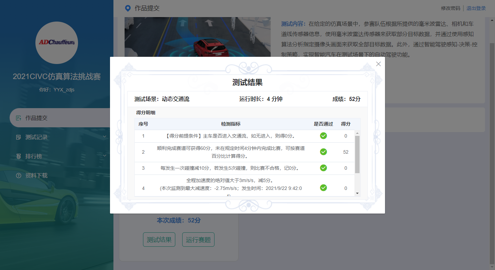

# ICVRCAutonomousDriving

#### 介绍
Python Implementation of Autunomous Driving Simulation

#### 软件架构
包含感知、决策、规划、控制相关部分

#### 安装教程
git clone git@gitee.com:icvrc2021-neu/icvrcautonomous-driving.git 到本地，可进行开发.

# 操作查询
## 分支操作
#### 创建分支
`创建新分支并切换`
git checkout -b dev
`提交新分支到远程`
git push --set-upstream origin dev

#### 删除分支
1.1.git branch 查看本地分支
1.2.查看远程分支 git branch -r

2.删除本地分支 xld-control-pid。 
(1) git checkout xld-control-changelane 删除分支前先切换到其他分支 
(2) git branch -D xld-control-pid

3.删除远程分支 git push origin --delete xld-control-pid
