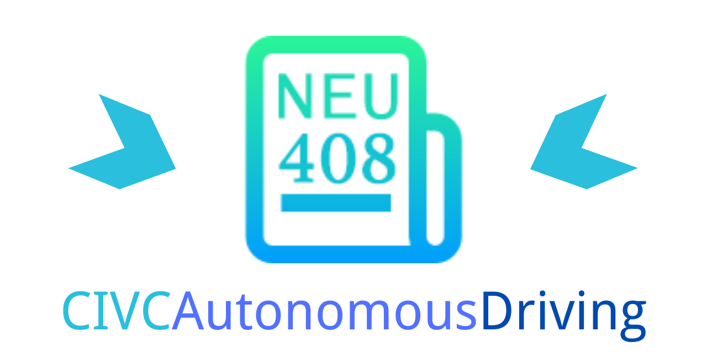

[](https://www.bilibili.com/video/BV1oq4y1d773?p=1&share_medium=android&share_plat=android&share_session_id=787c9d54-e2d0-4594-ba16-107703c68254&share_source=COPY&share_tag=s_i&timestamp=1634263873&unique_k=YKdnwO)
[](https://github.com/NEUAutonomousDriving408/CIVCAutonomousDriving/stargazers)
[](https://github.com/NEUAutonomousDriving408/CIVCAutonomousDriving/network)
[](https://github.com/NEUAutonomousDriving408/CIVCAutonomousDriving/graphs/contributors)
[](https://github.com/NEUAutonomousDriving408/CIVCAutonomousDriving/blob/master/LICENSE)

# 项目简介

本项目为2021中国（沈阳）智能网联汽车国际大会（2021 China (Shenyang) Intelligent Connected Vehicles Conference, CIVC）“AD Chauffeur 杯”仿真算法挑战赛自动驾驶赛题云逸行-东北大学赛队的比赛项目，并在决赛中获得第二名的成绩与自动驾驶组银奖的荣誉。项目包含感知、决策、控制相关部分，使用Python语言完成，运行过程与初赛决赛成绩如图所示。

- 注：目前比赛平台已关闭，无法在比赛平台运行！可以在AD Chauffeur 仿真平台官方网站申请使用平台，并修改部分代码迁移至新仿真环境！

- 感谢CIVC主办方与AD Chauffeur 仿真平台提供方，期待下一届大会与比赛的举办。

2021CIVC官网: https://civc.verodata.com.cn/

AD Chauffeur 仿真平台官网：https://www.adchauffeur.cn/

- 同时也感谢旷视公司开源的YOLOX目标检测算法模型与代码，我们在本项目的感知模块使用到了YOLOX算法，在COCO数据集中预训练的模型权重在仿真环境中也有较好的效果。

YOLOX开源项目：https://github.com/Megvii-BaseDetection/YOLOX

YOLOX论文地址：https://arxiv.org/abs/2107.08430

- 项目运行演示


- 预赛成绩


- 决赛成绩


## 内容亮点

###### 感知

1. 纯视觉测距，使用旷视开源YOLOX模型进行目标检测，并基于该模型进行了前方障碍物单目测距；
2. 使用点与三角形位置关系判断障碍所在车道位置，目标点取目标检测框的底边中点；
3. 识别自动驾驶车辆前方相邻三个车道最近障碍物的距离，为决策提供判据；
4. 针对深度学习模型输出不稳定的特点，对单目测距的数据进行了平滑处理。

###### 控制
1. 横纵控制分离的分段PID控制方式；
2. 使用车身前2米处车道线的位置，提高了控制的前瞻性；
3. 车规级车辆控制方式：follow, overtake, speedup状态机，后期speedup和overtake无缝切换，成为马路杀手。


## 项目运行环境

硬件环境：8核Intel(R) Core(TM) i7-6700K CPU @ 4.00GHz处理器，单卡NVIDIA GTX 1080显卡

操作系统：ubuntu 18.04

软件环境：Python 3.7.2


## 文件结构

```
  ├── ADCPlatform: 比赛开放的仿真平台的接口，平台数据的定义等
  |
  ├── control: 控制算法模块代码
  |
  ├── images: 运行过程的gif动图及比赛分数
  |
  ├── initial: 平台传感器及各算法模块参数的初始化
  |
  ├── perception: 感知算法模块代码，其中还包括YOLOX开源代码及预训练模型下载脚本
  |
  ├── planning: 决策规划算法模块代码
  |
  ├── sensor: 自动驾驶车辆传感器运行代码
  |
  ├── yolox: YOLOX项目提供的代码库文件夹，用来在项目中导入yolox模块
  |
  ├── requirements.txt: 项目的Python库依赖环境
  |
  └── main.py: 项目的运行主文件
```


## 安装与运行教程

- **注：目前比赛平台已关闭，无法在比赛平台运行！可以在AD Chauffeur 仿真平台官方网站申请使用平台，并修改部分代码迁移至新仿真环境！**

Step1. 下载项目代码至本地

```bash
git clone git@gitee.com:icvrc2021-neu/icvrcautonomous-driving.git
cd ./icvrcautonomous-driving
```

Step2. 进入到./perception/pretrainedmodel文件夹中，运行脚本下载YOLOX预训练模型权重

```bash
cd ./perception/pretrainedmodel

# 脚本默认下载yolox_l模型权重，如果想下载全部的模型权重，则运行如下代码
# bash DownloadModel.sh all
# 如果想下载某一个yolox的模型权重，则运行如下代码，其中yolox_tiny可改变成其他模型
# bash DownloadModel.sh yolox_tiny 
# 共五种模型权重有小到大分别为yolox_tiny, yolox_s, yolox_m, yolox_l, yolox_m
# 本项目代码中默认使用yolox_l模型权重
bash DownloadModel.sh  
cd ../..
```

Step3. 配置Python代码库运行环境

```bash
# 要求torch的版本为大于1.7的gpu版本
pip install -r requirements.txt
```

Step4. 修改main.py文件中的登录用户名与密码

```python
# 修改30行的字符串为自己的用户名，32行的字符串为密码
# 28行字符串为仿真平台服务器地址，迁移至新的仿真环境中时需要修改

27    # 设置服务器访问地址
28    serverUrl = 'https://web.simu.widc.icvrc.cn/api/'
29    # 设置登录用户名
30    username = 'YYX_zdjs'
31    # 设置登录密码
32    password = '******'
```

Step5. 在AD Chauffeur仿真平台网页运行仿真界面后，启动本项目

```bash
# 首先在网页端启动AD Chauffeur仿真平台
# 然后运行项目
python main.py
```


## 操作查询

### 分支操作
`务必养成良好习惯`

#### 创建分支
`创建新分支并切换`
git checkout -b dev || 也可以先开发(比如直接改了master)，准备切分支时才new新分支，此时更改会都转移到新分支上
`提交新分支到远程`

git push --set-upstream origin dev

#### 合并分支
`开发结束后测试稳定即可合并到master`
1. git checkout master

2. git merge xld-control-pid

3. 必要时候解决冲突文件，注意注释后的代码合并进来不会提示。。。

#### 删除分支
1.1.查看本地分支 git branch 

1.2.查看远程分支 git branch -r

2.删除本地分支 
git branch -D xld-control-pid

3.删除远程分支 
git push origin --delete xld-control-pid

### 版本管理

#### 强制回退
`删除中间所有错误提交`
git reset --hard version-number

git reset version-number

`回退到上一个版本 不加^会有原地恢复的问题`
git revert HEAD


